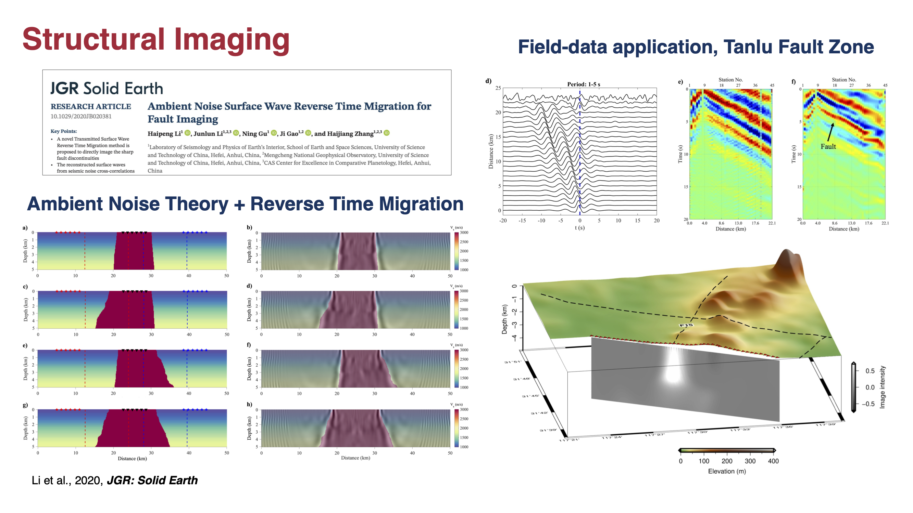

 * Image the subsurface structure using the transmitted wave RTM (T-RTM) method (Li et al., 2020, *JGR:Solid Earth*). T-RTM can utilize the surface waves retrieved from ambient noise interferometry, or body waves from earthquakes that occur in the Earth's interior.

  

