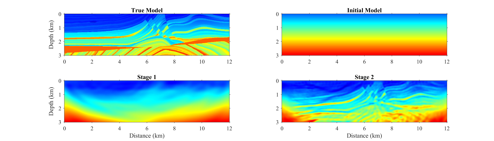
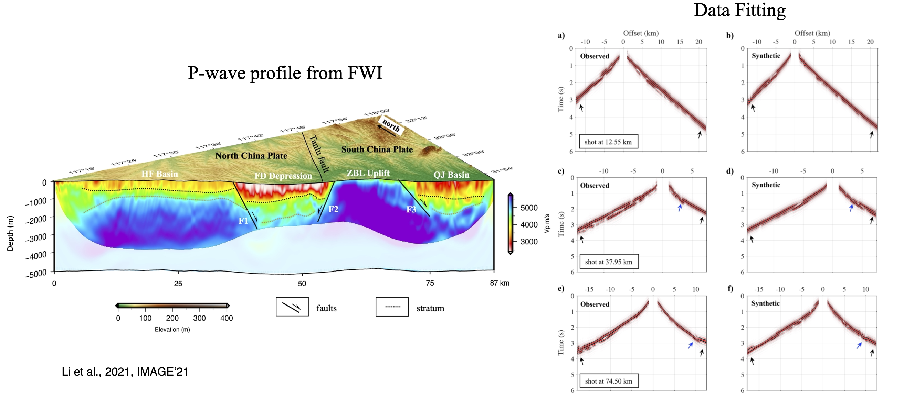

 * Develop a unified Full-waveform Inversion platform with features of two and three dimensions, acoustic and elastic medium, and high-performance computing.
  * Apply FWI on the wide-aperture land seismic dataset to reveal crustal structures and investigate the underlying tectonophysics. Study the optimal preprocessing & inversion workflow for field-data FWI applications.

  

##### Marmousi Model Example 

##### Field-data Application

