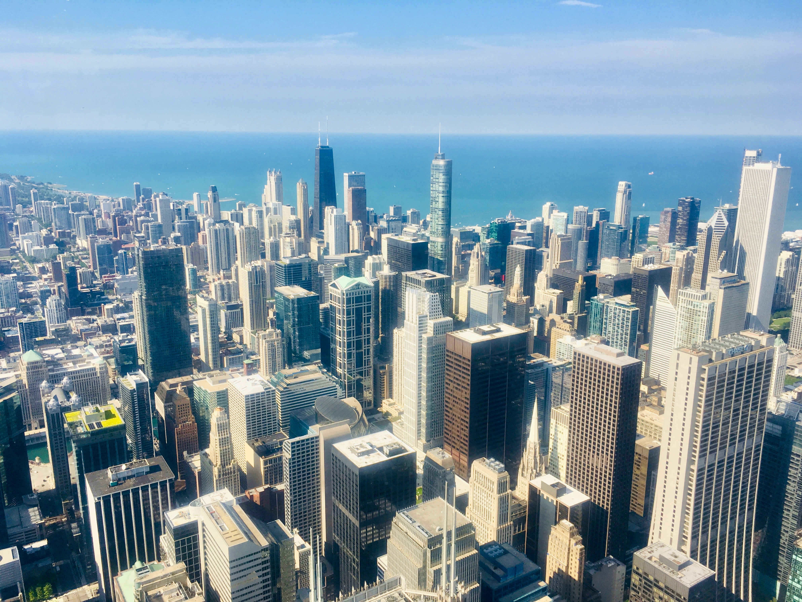
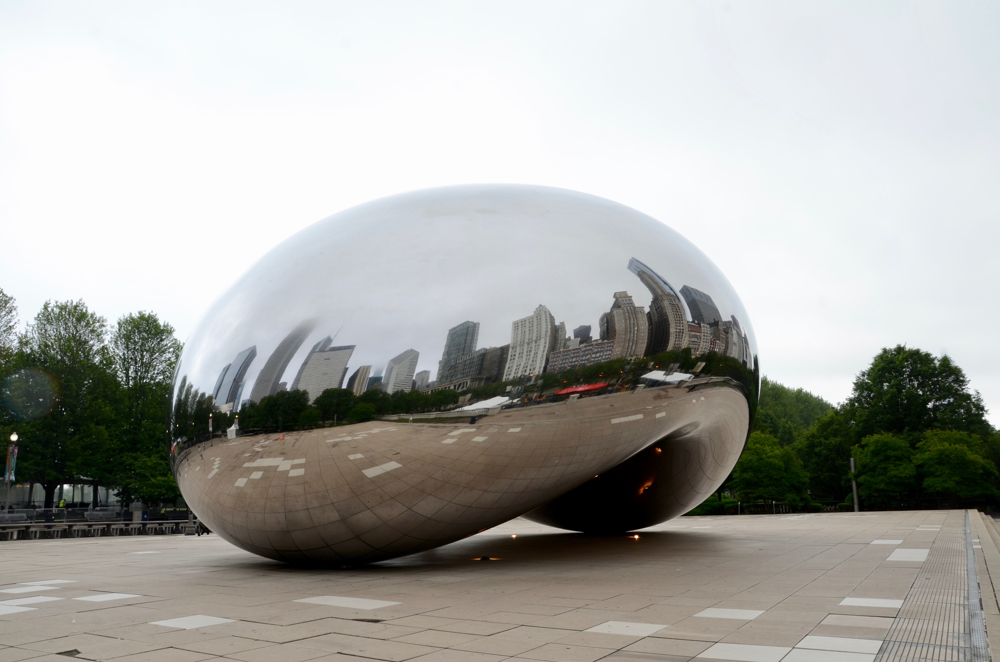
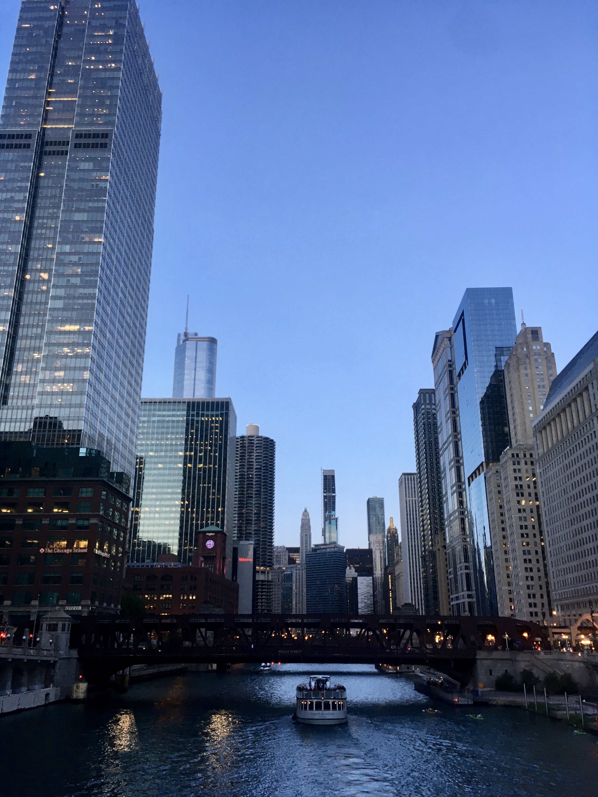
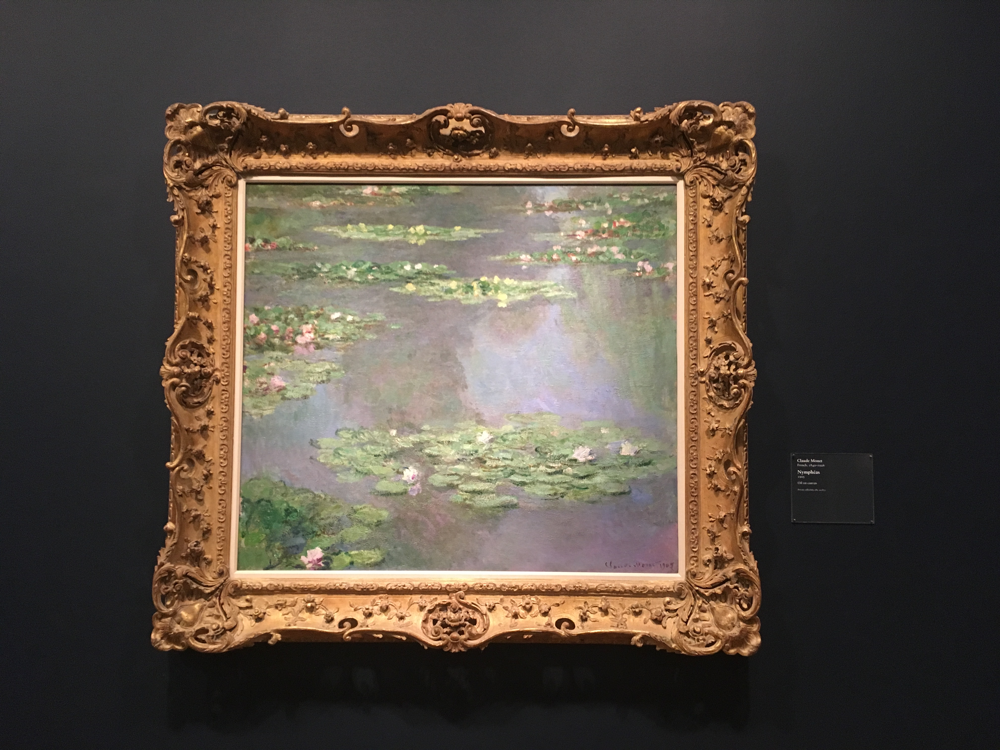
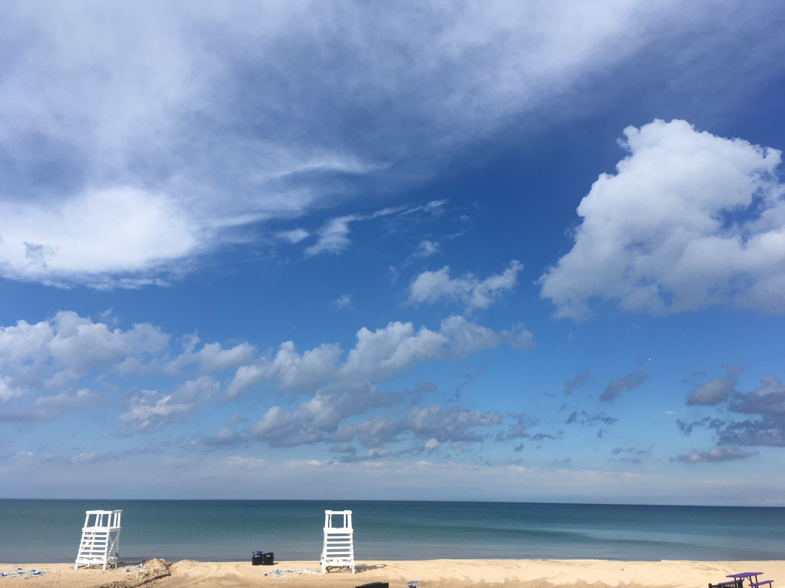

Chicago, by Lake Michigan, is so unique. The architecture of its buildings, the Monuments, the art and natural science museums, and the most prestigious universities here...

<!-- more -->

### Skyline of Chicago

### City View of Chicago

### Art & Science Museums

### Lake Michigan

